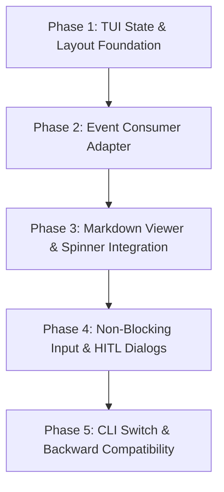

# Proposal: Multi-Window Console Application for Torvalds AI Agent

## 1. Overview

This proposal outlines the implementation plan for a **Multi-Window Terminal User Interface (TUI)** for the **Torvalds AI Agent**. 

Using Python's `rich` library (`rich.layout.Layout` and `rich.live.Live`), this upgrade introduces a persistent, multi-pane terminal workspace that displays live formatted Markdown, real-time background task progress, agent telemetry, and an interactive non-blocking command bar—all seamlessly connected to Torvalds's existing `EventConsumer` and `FunctionAgent` workflow.

---

## 2. Problem Statement

While Torvalds AI Agent offers comprehensive capabilities (tool retrieval, HITL, database/git toolkits, caching, and event streaming), its terminal presentation remains a linear, sequential REPL:
1. **Context Vanishes on Scrolling**: Long LLM responses and multi-step tool logs scroll off the screen, requiring manual terminal scrolling.
2. **Hidden Execution Progress**: During long multi-tool tasks (e.g. running apt scripts, analyzing large repos, multi-step queries), users see only a single-line spinner without visibility into intermediate tool calls, elapsed times, or loop iteration status.
3. **Blocking REPL**: The input prompt (`console.input`) blocks the execution thread, preventing background event updates or dynamic UI rendering while the user types.
4. **Scattered Metrics**: Request stats and session summaries are appended at the bottom as trailing panels, cluttering the terminal history.

---

## 3. Proposed Architecture

### 3.1 Architectural Blueprint

```
┌────────────────────────────────────────────────────────────────────────┐
│                        Torvalds TUI Workspace                          │
│                                                                        │
│   ┌────────────────────────────────────────────────────────────────┐   │
│   │ Header Panel: Agent Info, Model, Memory, Session Clock         │   │
│   ├───────────────────────────────┬────────────────────────────────┤   │
│   │ Main Document Pane (65%)      │ Sidebar Pane (35%)             │   │
│   │                               │                                │   │
│   │ - Status & Spinner Overlay    │ ┌────────────────────────────┐ │   │
│   │ - rich.markdown.Markdown      │ │ Background Workers &       │ │   │
│   │ - Pygments Code Blocks        │ │ Task Progress              │ │   │
│   │ - Virtual Buffer Pagination   │ │ - rich.progress.Progress   │ │   │
│   │                               │ ├────────────────────────────┤ │   │
│   │                               │ │ Agent Telemetry & State    │ │   │
│   │                               │ │ - Token metrics, cache %   │ │   │
│   │                               │ │ - Active retrieved tools   │ │   │
│   │                               │ └────────────────────────────┘ │   │
│   ├───────────────────────────────┴────────────────────────────────┤   │
│   │ Interactive Non-Blocking Input Bar & HITL Dialog               │   │
│   └────────────────────────────────────────────────────────────────┘   │
└────────────────────────────────────────────────────────────────────────┘
```

### 3.2 Key Capabilities

1. **Persistent Markdown Viewer**:
   - Displays agent output with full Markdown formatting (headings, tables, syntax-highlighted code blocks, bullet points).
   - When a query is running: displays an animated `rich.spinner.Spinner` and real-time step descriptions (e.g. `⠋ Calling tool: git_status()`).
   - Supports page scrolling (`PgUp` / `PgDn`) for long responses.
2. **Background Workflow & Tool Progress**:
   - Hooks into `EventConsumer` to visualize workflow iterations (`iteration / MAX_ITERATIONS`).
   - Real-time `rich.progress.Progress` tracking of active tool executions, complete with elapsed time indicators and spinners.
3. **Agent Telemetry & State Inspector**:
   - Integrates with `RequestStatsHandler` and `agent_cache_system`.
   - Real-time display of token counts, inference latency, cache hit rates, and loaded toolkits.
4. **Non-Blocking Command Bar & HITL Integration**:
   - Continuous 12–15 FPS render loop that never freezes while the user types.
   - Slash commands supported (`\stats`, `\toggle-hitl`, `\clear`, `\exit`, `\help`).
   - Human-in-the-Loop (HITL) prompt integration: when `InputRequiredEvent` fires, the command bar switches into a highlighted confirmation/input dialog without disrupting the surrounding layout.

---

## 4. Component Design & Integration

The implementation is modularized under a new `components/tui/` package to preserve zero side-effects on existing core code:

```
agent-torvalds/
├── components/
│   ├── tui/
│   │   ├── __init__.py
│   │   ├── layout_manager.py     # Hierarchical Layout construction & styling
│   │   ├── state_bridge.py       # TUI State & event bridge for EventConsumer
│   │   ├── input_reader.py       # Cross-platform non-blocking keyboard input
│   │   ├── markdown_view.py      # Markdown panel with spinner & buffer pagination
│   │   ├── progress_view.py      # Background task monitor with rich.progress
│   │   ├── telemetry_view.py     # Live statistics and agent telemetry renderer
│   │   └── tui_app.py            # Main TUI orchestrator with Live(screen=True)
```

### 4.1 State Bridge (`components/tui/state_bridge.py`)

Acts as the reactive bridge between `EventConsumer` and the TUI rendering loop:

```python
import threading
from typing import Optional, List, Dict, Any

class TuiState:
    def __init__(self):
        self.lock = threading.Lock()
        self.is_busy: bool = False
        self.current_query: str = ""
        self.status_message: str = "Ready"
        self.active_tool: Optional[str] = None
        self.markdown_content: str = ""
        self.workflow_iteration: int = 0
        self.max_iterations: int = 10
        self.hitl_active: bool = False
        self.hitl_prompt: str = ""
        self.hitl_timeout: int = 30
        self.stats_data: Dict[str, Any] = {}
```

### 4.2 Event Consumer Integration

In `components/event_consumer.py`, a simple callback hook informs the `TuiState` of incoming events:

```python
# Event Consumer Hook Integration
class TuiEventAdapter:
    def __init__(self, tui_state: TuiState, progress_monitor):
        self.state = tui_state
        self.progress = progress_monitor

    def on_tool_call_start(self, tool_name: str, tool_args: dict):
        with self.state.lock:
            self.state.status_message = f"Calling tool `{tool_name}`..."
            self.state.active_tool = tool_name
        self.progress.add_or_update_tool_task(tool_name)

    def on_tool_call_end(self, tool_name: str, result: str):
        self.progress.complete_tool_task(tool_name)

    def on_stream_token(self, token: str):
        with self.state.lock:
            self.state.markdown_content += token
```

### 4.3 Layout Manager (`components/tui/layout_manager.py`)

Configures and updates the four primary panes:

```python
from rich.layout import Layout

def build_torvalds_layout() -> Layout:
    root = Layout(name="root")
    
    # Vertical: Header, Main Area, Footer Input
    root.split_column(
        Layout(name="header", size=3),
        Layout(name="body", ratio=1),
        Layout(name="footer", size=3),
    )
    
    # Body: Left (Markdown 65%), Right (Sidebar 35%)
    root["body"].split_row(
        Layout(name="markdown_pane", ratio=65),
        Layout(name="sidebar", ratio=35),
    )
    
    # Sidebar: Top (Progress), Bottom (Telemetry)
    root["sidebar"].split_column(
        Layout(name="progress_pane", ratio=1),
        Layout(name="telemetry_pane", ratio=1),
    )
    return root
```

---

## 5. CLI & Configuration Interface

### 5.1 Command Line Arguments in `agent-torvalds.py`

```python
parser.add_argument(
    "--tui",
    action="store_true",
    default=True,
    help="Launch interactive multi-window TUI mode (default: enabled)",
)
parser.add_argument(
    "--no-tui",
    action="store_false",
    dest="tui",
    help="Disable multi-window TUI and use classic linear REPL",
)
```

### 5.2 Environment Variable Controls

| Environment Variable | Default | Description |
| :--- | :--- | :--- |
| `TORVALDS_TUI_ENABLED` | `true` | Enable or disable multi-window TUI workspace. |
| `TORVALDS_TUI_FPS` | `15` | Target refresh rate for the live render loop (10–30 FPS). |
| `TORVALDS_TUI_PAGING` | `true` | Enable buffer scrolling (`PgUp`/`PgDn`) in the Markdown pane. |

---

## 6. Implementation Roadmap

The implementation is broken down into structured, isolated phases:



### Phase 1: TUI State & Layout Foundation
- Implement `components/tui/layout_manager.py` with Header, Markdown Pane, Progress Pane, Telemetry Pane, and Footer.
- Implement `components/tui/state_bridge.py` with thread-safe state synchronization.

### Phase 2: Event Consumer Adapter
- Create `TuiEventAdapter` in `components/tui/event_bridge.py`.
- Connect workflow events (`ToolCall`, `ToolCallResult`, `AgentStream`, `InputRequiredEvent`, `StopEvent`) without modifying core workflow logic.

### Phase 3: Markdown Viewer & Spinner Integration
- Implement `components/tui/markdown_view.py`.
- Dynamic rendering: shows `Spinner("dots")` and current reasoning step during execution; switches to rendered `Markdown` upon completion.
- Support virtual scroll offset for long markdown outputs.

### Phase 4: Non-Blocking Input & HITL Dialogs
- Implement `components/tui/input_reader.py` with cross-platform keystroke polling (`msvcrt` on Windows, `select`/`termios` on Linux).
- Integrate `HumanLoopHandler` questions into the Input Bar / Modal alert panel.

### Phase 5: CLI Switch & Compatibility
- Add `--tui` / `--no-tui` CLI arguments in `agent-torvalds.py`.
- Ensure headless/piped input fallback to the classic linear REPL when `not sys.stdin.isatty()`.

---

## 7. Risk Assessment & Mitigation

| Risk | Impact | Mitigation Strategy |
| :--- | :--- | :--- |
| **Terminal Size Constraints** | UI truncation on small terminal windows (< 80 columns). | Implement minimum width check; display a compact fallback layout or warning panel if dimensions are below $80 \times 24$. |
| **Non-TTY Environments** | Automated test pipelines or SSH scripts lacking interactive TTY. | Auto-detect `sys.stdin.isatty()`: automatically fall back to classic REPL mode if non-interactive. |
| **Windows vs Linux Keystrokes** | Keystroke handling differences across operating systems. | Abstract input handling inside `input_reader.py` with platform branches (`msvcrt` on Windows, `termios` on POSIX). |
| **External Whiptail Conflict** | Whiptail password dialogs clearing terminal screen buffer. | Use `Live.stop()` before launching Whiptail subprocess, and `Live.start()` upon return, supported by `spinner_controller.pause_context()`. |

---

## 8. Conclusion & Recommendation

Integrating a multi-window TUI into **Torvalds AI Agent** delivers a dramatic upgrade in usability and developer experience while preserving 100% of the underlying architecture. 

Because `agent-torvalds` already features `rich`, `EventConsumer`, `SpinnerController`, and `RequestStatsHandler`, all necessary hooks are ready for immediate integration.

**Recommended Action**: Approve this proposal for implementation following the 5-phase roadmap.
